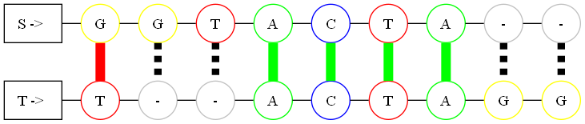

# Alineamiento de secuencias con algoritmo de Needleman-Wunsch

Programa de alineamiento de secuencias de ADN utilizando el algoritmo Needleman-Wunsch. Para ello se requieren 2 archivos tipo *tex* que contienen las secuencias a alienear.

Este programa


## Autores

- [@sunxyco](https://github.com/sunxyco)
- [@waripole](https://github.com/waripole)


## Ejecución

Para ejecutar el programa, ejecute el siguiente comando:

```bash
  ./alineamaiento -C1 S.tex -C2 T.tex -u U.tex -V n
```

En donde:
* -C1 **S.tex** corresponde a la secuencia 1 (o cadena 1)
* -C2 **T.tex** corresponde a la secuencia 2 (o cadena 2)
* -u **U.tex** corresponde a la matriz de coincidencia
* -V **n** corresponde al valor de penalidad

## Especificaciones para los Archivos de Entrada

### Formato de los Archivos S.tex y T.tex

Para que el programa funcione correctamente, los archivos `S.tex` y `T.tex` deben cumplir con las siguientes condiciones:

* Los archivos deben ser de tipo texto plano con extención `.tex`.
* Deben contener **unicamente** la secuencia biológica en el siguiente formato.

#### Contenido del Archivo

* Cada archivo debe incluir **una única línea** con la secuencia de nucleótidos.
* La secuencia debe estar en formato **estrictamente lineal**, sin espacios ni caracteres adicionales.

Ejemplo válido:

```bash
    AGCTTC
```

### Formato del archivo U.tex
Para que el programa funcione correctamente, el archivo `U.tex` debe cumplir con las siguientes condiciones:

* El archivo debe ser de tipo texto plano con extención `.tex`.
* otra especificación...

#### Contenido del Archivo

Ejemplo válido:

En la matriz, la intersección de dos letras (`matriz[i][j]`) indica el valor de coincidencia entre ambas.

```bash
    2,-1,-1,-1,
    -1,2,-1,-1,
    -1,-1,2,-1,
    -1,-1,-1,2,
```

El contenido del archivo `U.tex` debe seguir el siguiente formato:

* Considerando el siguiente alfabeto `A = {'A', 'C', 'G', 'T'}` y la siguiente función U de coincidencia de las letras del alfabeto:

###
<div align="center">
  <table>
    <tr>
      <th></th>
      <th><span style=background-color:green;color:white;padding:5px>A</span></th>
      <th><span style="background-color:yellow;color:black;padding:5px;">C</span></th>
      <th><span style="background-color:blue;color:white;padding:5px;">G</span></th>
      <th><span style="background-color:red;color:white;padding:5px;">T</span></th>
    </tr>
    <tr>
      <th><span style="background-color:green;color:white;padding:5px;">A</span></th>
      <td>2</td>
      <td>-1</td>
      <td>-1</td>
      <td>-1</td>
    </tr>
    <tr>
      <th><span style="background-color:yellow;color:black;padding:5px;">C</span></th>
      <td>-1</td>
      <td>2</td>
      <td>-1</td>
      <td>-1</td>
    </tr>
    <tr>
      <th><span style="background-color:blue;color:white;padding:5px;">G</span></th>
      <td>-1</td>
      <td>-1</td>
      <td>2</td>
      <td>-1</td>
    </tr>
    <tr>
      <th><span style="background-color:red;color:white;padding:5px;">T</span></th>
      <td>-1</td>
      <td>-1</td>
      <td>-1</td>
      <td>2</td>
    </tr>
  </table>
</div>


### Ubicación

* Asegúrese de que los archivos estén en el directorio especificado para la ejecución del programa.

Si no se cumple este formato, el programa podría generar errores.


## Ejemplo de salida

Con un valor de penalida igual a **0** y comparando las secuencias:
* C1 **GGTACTA**
* C2 **TACTAGG**

La terminal mostrará el siguiente alineamiento:

```bash
    C1 | GGTACTA--
    C2 | T--ACTAGG
```


Además, se crea un archivo **png** para la visualización de este:
<div align="center">
  
</div>

En donde las **líneas**:
* **Color verde** indican un *match*.
* **Color rojo** indican un *mismatch*.
* **Punteadas** indican la presencia de un *gap*.

Los **bordes** han sido coloreados para identificar las bases de la siguiente forma:
* **A** *(adenina)* color **VERDE**.
* **C** *(citosina)* color **AZUL**.
* **G** *(guanina)* color **AMARILLO**.
* **T** *(timina)* color **ROJO**.


###

<div align="center">
  
</div>
